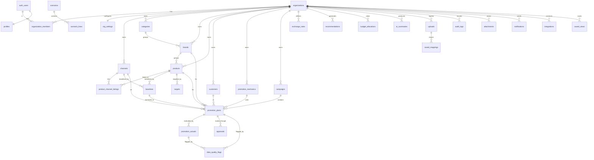

# PromoLift — Entity Relationship Map (Deliverable 3)



## Cardinality & dependency notes
- **organization_id** is the tenancy spine on every business table; all RLS pivots on it.
- A **promotion_plan** is the central fact: it references channel, brand, product, customer, mechanic,
  campaign and a baseline. Its derived metrics live in `calc` (jsonb snapshot) and are recomputed on every
  write by the deterministic engine.
- **promotion_actuals** may link to a plan (planned-vs-actual) **or** stand alone (imported historicals).
- **baselines** are reusable and carry reliability flags; a plan pins exactly one.
- **recommendations** are immutable, versioned snapshots (`as_of` + `settings_snapshot`) so history is
  reproducible even after weights/settings change (finding V8).
- **exchange_rates** are per (org, from, to, month); every cross-currency aggregate joins through them.
- **audit_logs** and **approvals** together give the full revision history required in §18/§13.

## Data-flow (calculation dependency order)
```
master data + baselines + targets + fx
        │
        ▼
promotion_plans.inputs ──► [deterministic calc engine] ──► plans.calc + dq_flags + dq_score
        │                                                        │
        ▼                                                        ▼
promotion_actuals.inputs ─► [engine] ─► actuals.calc (variance, accuracy, planned-vs-actual)
        │                                                        │
        └───────────────► [recommendation engine] ──► recommendations (score, band, confidence, explain)
                                     │
                                     ▼
                    [budget optimizer] ──► budget_allocations
                                     │
                                     ▼
                    [AI layer: structured-in → structured-out] ──► ai_summaries (narrative only)
```
AI sits at the **end** and consumes only computed JSON — it never feeds back into calculations.
